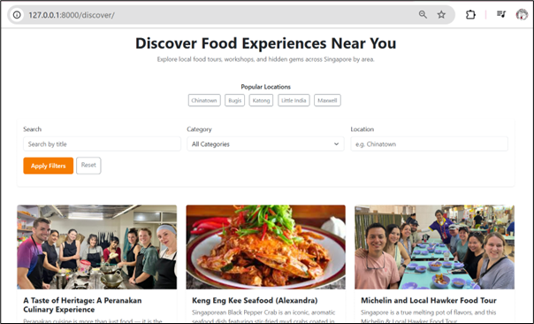
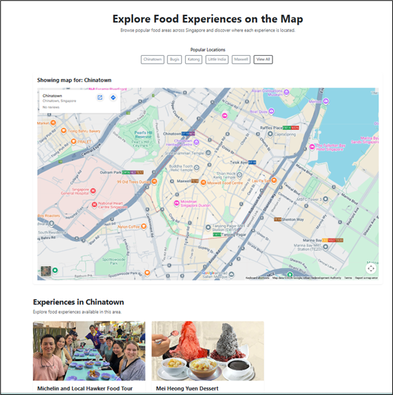
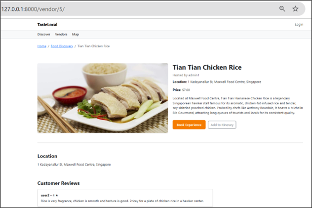

# 🍜 TasteLocal – Local Food Discovery Platform

TasteLocal is a Django-based web application that allows users to discover authentic local food experiences in Singapore.

---

## 🚀 Features

- 🔍 Discover food experiences with filters (location, category, keyword)
- 🗺️ Location-based discovery with interactive map
- 📍 Map view with dynamic location switching
- 🧾 View detailed experience pages
- ⭐ User reviews system
- 📅 Booking system
- 🧭 Add experiences to itinerary
- 🔐 User authentication (login/register)
- 👨‍🍳 Vendor-based experience management

---

## 🗺️ Location-Based Discovery

Users can:
- Filter experiences by location
- Click popular locations (Chinatown, Bugis, etc.)
- View experiences on a map
- Browse experiences under each map view

---

## 🛠️ Tech Stack

- Backend: Django
- Database: SQLite (local)
- Frontend: HTML, Bootstrap
- Maps: Google Maps Embed
- Version Control: Git & GitHub

---

## 📸 Screenshots

### Discover Page


### Map Page


### Experience Detail


---

## ▶️ How to Run Locally

```bash
git clone https://github.com/your-username/TasteLocal.git
cd TasteLocal
python -m venv venv
venv\Scripts\activate
pip install -r requirements.txt
python manage.py migrate
python manage.py runserver
